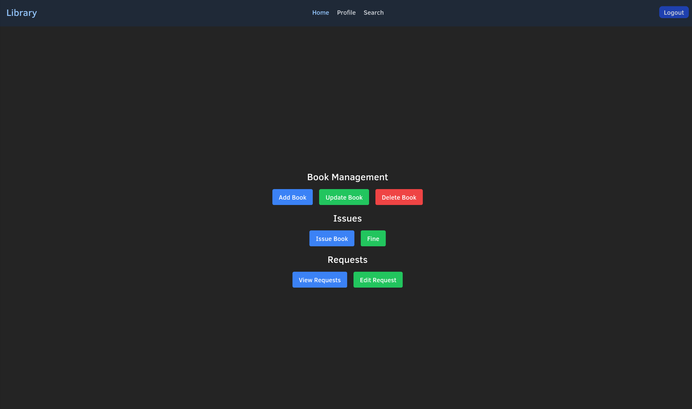

# Table of Contents
- [Table of Contents](#table-of-contents)
- [Introduction](#introduction)
  - [Context](#context)
  - [Purpose](#purpose)
  - [Detailed Contribution](#detailed-contribution)
- [SRS Use Cases](#srs-use-cases)
- [Software Design and Analysis](#software-design-and-analysis)
- [Testing Report](#testing-report)
- [Some Images](#some-images)

# Introduction

## Context

The Library Management System is a software application that is designed to manage the operations of a library.

The system will:

- Provide a user-friendly interface for the library staff to manage the library resources, such as books, journals, and other e-resources.
- Provide a user interface for the library members to search for and borrow library resources.
- Automate the process of managing the library resources, including the cataloging, circulation, and inventory management.
- Provide reports and analytics to help the library staff to make informed decisions about the library operations.

## Purpose

The purpose of this document is to provide the final report for the Library Management System project.

## Detailed Contribution

The project was developed by a team of 4 members, and each member contributed to the development of the system.

Most of the documentation was done together as a team.

The code part however: 
- Backend was done by Vishal (CS21BTECH11061).
- Frontend was suppose to be done by Ritvik, Nishanth and Jayachandra, but they were unable to do so because of multiple submissions and exams. In the end, a minimal part of the frontend was done by Vishal.

# SRS Use Cases

Due to the limited time and resources, we decided to focus on the use cases pertaining to the following modules:

- Book Management
- User Management
- Reservations alongs with issue management
- Requests along with voting system
- Partial implementation of Fine Management

Other modules such as E-Resource Managements, Statistics were not implemented due to time constraints.

The backend part of these Use Cases have been implemented, however, the frontend part is still under development.

# Software Design and Analysis

Total lines of code in Backend: 1496

```
 19 ./index.js
195 ./prisma/dev.db
  5 ./prisma/prisma_client.js
 96 ./prisma/schema.prisma
 40 ./prisma/data.sql
 15 ./config/routes_admin.js
 59 ./config/middleware.js
 16 ./config/routes_member.js
 38 ./config/routes.js
 45 ./config/routes_librarian.js
109 ./controllers/auth.js
 68 ./controllers/vote.js
126 ./controllers/user.js
106 ./controllers/issue.js
112 ./controllers/request.js
194 ./controllers/book.js
111 ./controllers/reserve.js
110 ./controllers/fine.js
 25 ./package.json
  7 ./.env
1496 total
```

Current number of lines in Frontend: 875

```
171 ./hooks/useGetter.js
 61 ./pages/user/Search.jsx
 52 ./pages/Login.jsx
 57 ./pages/Profile.jsx
 42 ./pages/About.jsx
 83 ./pages/Home.jsx
 42 ./components/member/home.jsx
 13 ./components/Loader.jsx
 11 ./components/librarian/issue_book.jsx
 46 ./components/librarian/home.jsx
 16 ./components/Reload.jsx
 64 ./components/Profile.jsx
 61 ./components/Navbar.jsx
 24 ./components/admin/home.jsx
  8 ./main.jsx
 20 ./index.css
 29 ./utils/auth.js
  2 ./utils/url.js
 29 ./utils/time.js
  6 ./utils/reactstuff.js
 13 ./App.css
 25 ./App.jsx
875 total
```

\newpage

# Testing Report

Due to the limited time and resources, we were not able to conduct a comprehensive testing of the Library Management System.

Most of the tests conducted were manual tests, and we were not able to automate the testing process.

While testing the functions, `route.js` was used to maintain the list of functions that were tested. All the tests were conducted on the local server, and the results were recorded in the same file.

\newpage

# Some Images




