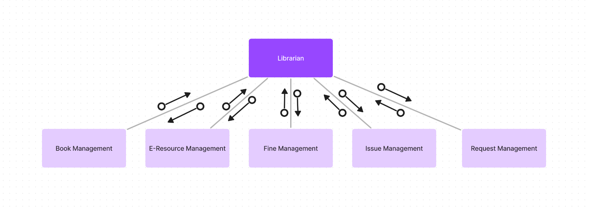
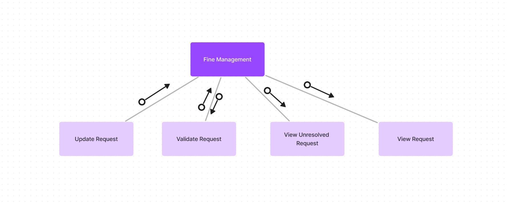
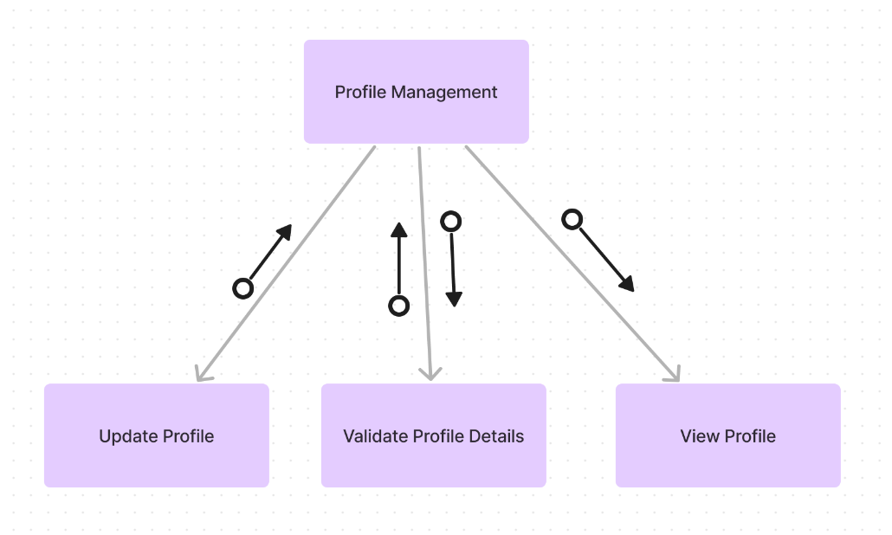
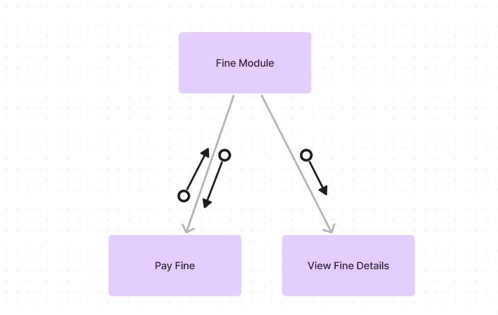

# Table of Contents

- [Table of Contents](#table-of-contents)
- [Overview](#overview)
  - [Context](#context)
  - [Purpose](#purpose)
- [Data Types](#data-types)
  - [Book Details](#book-details)
  - [E-Resource Details](#e-resource-details)
  - [Member Details](#member-details)
  - [Fine Details](#fine-details)
  - [Request Details](#request-details)
  - [Issue Details](#issue-details)
  - [Statistics](#statistics)
  - [Profile Details](#profile-details)
  - [Session Details](#session-details)
  - [Catalog Details](#catalog-details)
  - [Miscellaneous 1-attribute classes](#miscellaneous-1-attribute-classes)
- [Test Overview](#test-overview)
- [Unit Tests](#unit-tests)
  - [Admin Module](#admin-module)
    - [`Validate Member Details`](#validate-member-details)
    - [`Add Member`](#add-member)
    - [`Delete Member`](#delete-member)
    - [`Update Member`](#update-member)
    - [`View Member`](#view-member)
  - [Librarian Module](#librarian-module)
    - [`Validate Book Details`](#validate-book-details)
    - [`Add Book`](#add-book)
    - [`Remove Book`](#remove-book)
    - [`Update Book`](#update-book)
    - [`View Book`](#view-book)
    - [`Add Book Copy`](#add-book-copy)
    - [`Remove Book Copy`](#remove-book-copy)
    - [`Validate E-Resource Details`](#validate-e-resource-details)
    - [`Add E-Resource`](#add-e-resource)
    - [`Remove E-Resource`](#remove-e-resource)
    - [`Update E-Resource`](#update-e-resource)
    - [`Remove E-Resource`](#remove-e-resource-1)
    - [`View E-Resource`](#view-e-resource)
    - [`Validate Issue Details`](#validate-issue-details)
    - [`Issue Book`](#issue-book)
    - [`Update Issue`](#update-issue)
    - [`View Issue Details`](#view-issue-details)
    - [`View Unresolved Issues`](#view-unresolved-issues)
    - [`Validate Fines Details`](#validate-fines-details)
    - [`Add Fine`](#add-fine)
    - [`Remove Fine`](#remove-fine)
    - [`View Fine Details`](#view-fine-details)
    - [`View Unresolved Fines`](#view-unresolved-fines)
    - [`Validate Request Details`](#validate-request-details)
    - [`Update Request`](#update-request)
    - [`View Request Details`](#view-request-details)
    - [`View Unresolved Requests`](#view-unresolved-requests)
  - [Member Module](#member-module)
    - [`Search`](#search)
    - [`View Book Catalog`](#view-book-catalog)
    - [`View New Arrivals`](#view-new-arrivals)
    - [`View Popular Books`](#view-popular-books)
    - [`View Book Details`](#view-book-details)
    - [`View EResource Catalog`](#view-eresource-catalog)
    - [`View EResource Details`](#view-eresource-details)
    - [`Read EResource`](#read-eresource)
    - [`View Profile`](#view-profile)
    - [`Validate Reservation Details`](#validate-reservation-details)
    - [`Reserve Book`](#reserve-book)
    - [`Validate Request Details`](#validate-request-details-1)
    - [`Vote Request`](#vote-request)
    - [`Request`](#request)
    - [`Pay Fine`](#pay-fine)
    - [`View Fine Details`](#view-fine-details-1)
  - [Authentication Module](#authentication-module)
    - [`Validate Authentication`](#validate-authentication)
    - [`Add Session`](#add-session)
    - [`Delete Session`](#delete-session)
    - [`Validate Login`](#validate-login)
    - [`Login`](#login)
    - [`Logout`](#logout)
  - [Render Module](#render-module)
- [Integration Tests](#integration-tests)
  - [Authentication module](#authentication-module-1)
  - [Admin Module](#admin-module-1)
  - [Librarian Module](#librarian-module-1)
  - [Member Module](#member-module-1)
  - [Render Module](#render-module-1)
- [System Tests](#system-tests)
  - [Common Tests](#common-tests)
  - [Admin Tests](#admin-tests)
  - [Librarian Tests](#librarian-tests)
  - [User Tests](#user-tests)
- [Performance Tests](#performance-tests)
  - [Response Time](#response-time)
  - [Database Queries](#database-queries)
  - [Scalability](#scalability)
  - [Reliability](#reliability)
- [Testing Analysis](#testing-analysis)
  - [Count of Test Cases](#count-of-test-cases)
  - [Performance Tests Plans](#performance-tests-plans)
  - [Test Execution](#test-execution)
- [References](#references)

\newpage

<!--

Submit a tentative test plan for your software.
You will again submit the final test plan and test report later on after completing your coding and executing the test cases.
This tentative test plan will help you during the coding phase with better understanding of what is actually expected at the end.
You are required to perform functional testing.
If you wish, you can also perform structural testing.
Some extra marks may be given for doing structural testing.
During the testing phases, it is recommended to use softwares such as Jira for defect logging and tracking.
Your report should contain the following sections.

# Test Overview
List of all operations/modules that you plan to test

# Test Details
Unit tests for the modules
Integrating testing and the order in which you will integrate your modules and test cases for integrated modules.
System testing
Structural tests (optional)
Performance test
Stress test (optional)

# Test Analysis
We discussed the following seven types of black box testing in the class: equivalence class partitioning, boundary value analysis, cause-effect graphing, pair-wise testing, special cases, error guessing and state based testing.
Which of these methods did you use for generating the test cases, for which modules and the count of test cases.
Report this functional test summary in the form of a table.
Structural test plan/report (optional)
Performance test plan/report
Stress test plan/report (optional)

 -->

# Overview

## Context

The Library Management System is a software application that is designed to manage the operations of a library.

The system will:

- Provide a user-friendly interface for the library staff to manage the library resources, such as books, journals, and other e-resources.
- Provide a user interface for the library members to search for and borrow library resources.
- Automate the process of managing the library resources, including the cataloging, circulation, and inventory management.
- Provide reports and analytics to help the library staff to make informed decisions about the library operations.

## Purpose

The purpose of this document is to outline the test plan for the Library Management System.

The test plan will include the following:

- Unit tests for the modules
- Integrating testing and the order in which the modules will be integrated
- Test cases for the integrated modules
- System testing for the entire system
- Performance testing for the backend services, APIs, and database

\newpage

# Data Types

Considering that the arguments to the functions are going to be objects of custom data-types, all custom data-types are defined below.

## Book Details

This custom data-type is used to store the details of a book.

```python

class bookdetails {
  bookId;
  title;
  author;
  publisher;
  ISBN;
  category;
  copies;
}

```

Thus, it has 7 attributes.

Here,

- `bookId` is the unique identifier for the book. Regex of the form `[0-9]+` is used.
- `title` is the title of the book. Any string is allowed.
- `author` is the author of the book. Regex of the form `[a-zA-Z]+` is used.
- `publisher` is the publisher of the book. Regex of the form `[a-zA-Z]+` is used.
- `ISBN` is the International Standard Book Number of the book. Since 13 digit ISBNs are used, regex of the form `[0-9]{13}` is used.
- `category` is the category of the book. Regex of the form `[a-zA-Z]+` is used. Predefined categories are used.
- `copies` is the number of copies of the book available in the library. Regex of the form `[0-9]+` is used.

## E-Resource Details

This custom data-type is used to store the details of an e-resource.

```python

class eResourceDetails {
  eResourceId;
  title;
  author;
  publisher;
  URL;
  category;
}

```

Thus, it has 6 attributes.

Here,

- `eResourceId` is the unique identifier for the e-resource. Regex of the form `[0-9]+` is used.
- `title` is the title of the e-resource. Any string is allowed.
- `author` is the author of the e-resource. Regex of the form `[a-zA-Z]+` is used.
- `publisher` is the publisher of the e-resource. Regex of the form `[a-zA-Z]+` is used.
- `URL` is the Uniform Resource Locator of the e-resource. Regex of the form `https?://(www\.)?[a-zA-Z0-9]+\.[a-zA-Z]+` is used.
- `category` is the category of the e-resource. Regex of the form `[a-zA-Z]+` is used. Predefined categories are used.

## Member Details

This custom data-type is used to store the details of a member.

```python

class memberDetails {
  memberId;
  name;
  email;
  phone;
  address;
  membershipType;
}

```

Thus, it has 6 attributes.

Here,

- `memberId` is the unique identifier for the member. Regex of the form `[0-9]+` is used.
- `name` is the name of the member. Regex of the form `[a-zA-Z]+` is used.
- `email` is the email of the member. Regex of the form `[a-zA-Z0-9]+@[a-zA-Z]+\.[a-zA-Z]+` is used.
- `phone` is the phone number of the member. Regex of the form `[0-9]{10}` is used.
- `address` is the address of the member. Regex of the form `[a-zA-Z0-9]+` is used.
- `membershipType` is the type of membership of the member. Regex of the form `[a-zA-Z]+` is used. Predefined membership types are used. It can be `student`, `faculty`, `librarian`, etc.

## Fine Details

This custom data-type is used to store the details of a fine.

```python

class fineDetails {
  fineId;
  memberId;
  amount;
  reason;
  date;
}

```

Thus, it has 5 attributes.

Here,

- `fineId` is the unique identifier for the fine. Regex of the form `[0-9]+` is used.
- `memberId` is the unique identifier for the member. Regex of the form `[0-9]+` is used.
- `amount` is the amount of the fine. Regex of the form `[0-9]+` is used.
- `reason` is the reason for the fine. Any string is allowed.
- `date` is the date of the fine. Regex of the form `[0-9]{4}-[0-9]{2}-[0-9]{2}` is used.

## Request Details

This custom data-type is used to store the details of a request.

```python

class requestDetails {
  requestId;
  memberId;
  bookId;
  date;
}

```

Thus, it has 4 attributes.

Here,

- `requestId` is the unique identifier for the request. Regex of the form `[0-9]+` is used.
- `memberId` is the unique identifier for the member. Regex of the form `[0-9]+` is used.
- `bookId` is the unique identifier for the book. Regex of the form `[0-9]+` is used.
- `date` is the date of the request. Regex of the form `[0-9]{4}-[0-9]{2}-[0-9]{2}` is used.

## Issue Details

This custom data-type is used to store the details of an issue.

```python

class issueDetails {
  issueId;
  bookId;
  memberId;
  dateOfIssue;
  dateOfReturn;
}

```

Thus, it has 5 attributes.

Here,

- `issueId` is the unique identifier for the issue. Regex of the form `[0-9]+` is used.
- `bookId` is the unique identifier for the book. Regex of the form `[0-9]+` is used.
- `memberId` is the unique identifier for the member. Regex of the form `[0-9]+` is used.
- `dateOfIssue` is the date of issue of the book. Regex of the form `[0-9]{4}-[0-9]{2}-[0-9]{2}` is used.
- `dateOfReturn` is the date of return of the book. Is null if the book is not returned. Regex of the form `[0-9]{4}-[0-9]{2}-[0-9]{2}` is used.

## Statistics

This custom data-type is used to store the statistics of a member.

```python

class statistics {
  booksIssued;
  booksReturned;
  finesPaid;
  finesUnpaid;
  requestsMade;
  reservationsMade;
}

```

Thus, it has 6 attributes.

Here,

- `booksIssued` is the number of books issued to the member till date. Regex of the form `[0-9]+` is used.
- `booksReturned` is the number of books returned by the member till date. Regex of the form `[0-9]+` is used.
- `finesPaid` is the amount of fines paid by the member till date. Regex of the form `[0-9]+` is used.
- `finesUnpaid` is the amount of fines unpaid by the member till date. Regex of the form `[0-9]+` is used.
- `requestsMade` is the number of requests made by the member till date. Regex of the form `[0-9]+` is used.
- `reservationsMade` is the number of reservations made by the member till date. Regex of the form `[0-9]+` is used.

## Profile Details

This custom data-type is used to store the details of a member profile.

```python
class profileDetails {
  object memberDetails;
  object statistics;
}

```

Thus, it has 2 attributes, each made of 6 and 6 attributes respectively.

Here,

- `memberDetails` is the details of the member. It is an object of the `memberDetails` custom data-type.
- `statistics` is the statistics of the member. It is an object of the `statistics` custom data-type.

## Session Details

This custom data-type is used to store the details of a session of a user.

```python

class sessionDetails {
  sessionId;
  userId;
  loginTime;
  logoutTime;
}

```

Thus, it has 4 attributes.

Here,

- `sessionId` is the unique identifier for the session. Regex of the form `[0-9]+` is used.
- `userId` is the unique identifier for the user. Regex of the form `[0-9]+` is used.
- `loginTime` is the time of login of the user. Regex of the form `[0-9]{4}-[0-9]{2}-[0-9]{2} [0-9]{2}:[0-9]{2}:[0-9]{2}` is used.
- `logoutTime` is the time of logout of the user if the user has logged out. Regex of the form `[0-9]{4}-[0-9]{2}-[0-9]{2} [0-9]{2}:[0-9]{2}:[0-9]{2}` is used.

## Catalog Details

This custom data-type is used to store the details of the catalog of the library.

```python

class catalogId {
  bookId[];
  eResourceId[];
}

```

Thus, it has 2 attributes, each of which is an array of bookIds and eResourceIds respectively.

Here,

- `bookId[]` is the array of the unique identifier for the book.
- `eResourceId[]` is the array of the unique identifier for the e-resource.

## Miscellaneous 1-attribute classes

The following classes have only 1 attribute each:

```python

class query{
  query; # Regex of the form `[a-zA-Z]+` is used.
}

class action{
  action; # Regex of the form `[a-zA-Z]+` is used. Predefined actions are used.
}

class vote{
  vote; # Boolean value is used.
}

class status{
  status; # Regex of the form `[a-zA-Z]+` is used. Predefined statuses are used.
}

class libraryResource{
  libraryResource; # Regex of the form `[a-zA-Z0-9]+` is used.
}
```

\newpage

# Test Overview

Currently, the system is divided into the following modules:

- Admin Done
- Librarian
- Member
- Authentication Done
- Render Done

The following diagram shows the high-level structure of the system:


We will start by writing unit tests for the individual leaf modules and then move on to integrating the modules and writing test cases for the integrated modules.

We will use the following methods for generating the test cases:

- Cause-effect graphing
- Special cases
- Error guessing
- State based testing

The test cases will be generated based on the requirements and specifications of the system.

We will follow the bottom-up approach for integration testing.

\newpage

# Unit Tests

## Admin Module

The Admin module is responsible for managing the library staff and its members.


In the above diagram, there are 5 leaf modules that can be tested individually.

### `Validate Member Details`

The `Validate Member Details` module is responsible for validating the details of a member.

It takes `memberDetails` as input and returns a `status` message.

The `memberDetails` input is a JSON object that contains the details of the member as mentioned above.

The `status` message is a string that indicates the success or failure of the operation.

Below are the example test cases for the `Validate Member Details` module:

| Input                                                                           | Description             | Expected Output         |
| ------------------------------------------------------------------------------- | ----------------------- | ----------------------- |
| { "101", "John", "cs21btech11061@iith.ac.in", "9876543210", "IITH", "student" } | Valid input             | Valid member details    |
| { "101", "John", "-1", "9876543210", "IITH", "student" }                        | Invalid email           | Invalid email address   |
| { "101", "John", "cs21btech11061@iith.ac.in", "1391514", "IITH", "student" }    | Invalid phone number    | Invalid phone number    |
| { "101", "John", "cs21btech11061@iith.ac.in", "9876543210", "", "-1" }          | Invalid membership type | Invalid membership type |
| { "-45", "John", "cs21btech11061@iith.ac.in", "9876543210", "", "-1" }          | Invalid member ID       | Invalid member ID       |

### `Add Member`

The `Add Member` module is responsible for adding a new member to the library system.

It takes `memberDetails` as input and returns a `status` message.

The `memberDetails` input is a JSON object that contains the details of the member as mentioned above.

The `status` message is a string that indicates the success or failure of the operation.

Below are the example test cases for the `Add Member` module:

| Input                                                                           | Description             | Expected Output           |
| ------------------------------------------------------------------------------- | ----------------------- | ------------------------- |
| { "101", "John", "cs21btech11061@iith.ac.in", "9876543210", "IITH", "student" } | Valid input             | Member added successfully |
| { "101", "John", "-1", "9876543210", "IITH", "student" }                        | Invalid email           | Invalid email address     |
| { "101", "John", "cs21btech11061@iith.ac.in", "1391514", "IITH", "student" }    | Invalid phone number    | Invalid phone number      |
| { "101", "John", "cs21btech11061@iith.ac.in", "9876543210", "", "-1" }          | Invalid membership type | Invalid membership type   |

### `Delete Member`

The `Delete Member` module is responsible for deleting a member from the library system.

It takes `memberId` as input and returns a `status` message.

The `memberId` input is the unique ID of the member to be deleted.

The `status` message is a string that indicates the success or failure of the operation.

Below are the example test cases for the `Delete Member` module:

| Input | Description       | Expected Output             |
| ----- | ----------------- | --------------------------- |
| "101" | Valid input       | Member deleted successfully |
| "-45" | Invalid member ID | Member not found            |

### `Update Member`

The `Update Member` module is responsible for updating the details of a member in the library system.

It takes `memberDetails` as input and returns a `status` message.

The `memberDetails` input is a JSON object that contains the details of the member as mentioned above.

The `status` message is a string that indicates the success or failure of the operation.

Below are the example test cases for the `Update Member` module:

| Input                                    | Description             | Expected Output             |
| ---------------------------------------- | ----------------------- | --------------------------- |
| { "101", "", "", "1234567890", "", "" }  | Valid input             | Member updated successfully |
| { "-2", "", "", "1234567890", "", "" }   | Invalid ID              | Member not found            |
| { "101", "", "", "12345", "", ""}        | Invalid phone number    | Invalid phone number        |
| { "101", "", "", "1234567890", "", "-1"} | Invalid membership type | Invalid membership type     |

### `View Member`

The `View Member` module is responsible for viewing the details of a member in the library system.

It takes `memberId` as input and returns the `memberDetails`.

The `memberId` input is the unique ID of the member.

The `memberDetails` input is a JSON object that contains the details of the member as mentioned above.

Below are the example test cases for the `View Member` module:

| Input  | Description       | Expected Output  |
| ------ | ----------------- | ---------------- |
| "101"  | Valid input       | Member details   |
| "-45"  | Invalid member ID | Member not found |
| "2000" | Invalid member ID | Member not found |

\newpage

## Librarian Module

The Librarian module is responsible for managing the library resources, such as books, journals, and other e-resources.



There are 5 mains modules in the Librarian module within which there are 26 leaf modules.

\newpage

Below is the Book Management module:


### `Validate Book Details`

The `Validate Book Details` module is responsible for validating the details of a book.

It takes `bookDetails` as input and returns a `status` message.

The `bookDetails` input is a JSON object that contains the details of the book as mentioned above.

The `status` message is a string that indicates the success or failure of the operation.

Below are the example test cases for the `Validate Book Details` module:

| Input                                                                    | Description | Expected Output    |
| ------------------------------------------------------------------------ | ----------- | ------------------ |
| { "101", "Book1", "Author1", "Publisher1", "1234567890", "Fiction", 5 }  | Valid input | Valid book details |
| { "101", "Book1", "Author1", "Publisher1", "1234567890", "Fiction", -1 } | Invalid     | Invalid copies     |
| { "101", "Book1", "Author1", "Publisher1", "1234567890", "", 5 }         | Invalid     | Invalid category   |
| {"101", "Book1", "Author1", "Publisher1", "" , "Fiction", 5 }            | Invalid     | Invalid ISBN       |
| {"101", "Book1", "Author1", "", "1234567890", "Fiction", 5 }             | Invalid     | Invalid publisher  |
| {"101", "Book1", "", "Publisher1", "1234567890", "Fiction", 5 }          | Invalid     | Invalid author     |
| {"101", "", "Author1", "Publisher1", "1234567890", "Fiction", 5 }        | Invalid     | Invalid title      |
| {"-3", "Book1", "Author1", "Publisher1", "1234567890", "Fiction", 5 }    | Invalid     | Invalid book ID    |

### `Add Book`

The `Add Book` module is responsible for adding a new book to the library system.

It takes `bookDetails` as input and returns a `status` message.

The `bookDetails` input is a JSON object that contains the details of the book as mentioned above.

The `status` message is a string that indicates the success or failure of the operation.

Below are the example test cases for the `Add Book` module:

| Input                                                                    | Description | Expected Output   |
| ------------------------------------------------------------------------ | ----------- | ----------------- |
| { "101", "Book1", "Author1", "Publisher1", "1234567890", "Fiction", 5 }  | Valid input | Book added        |
| { "101", "Book1", "Author1", "Publisher1", "1234567890", "Fiction", -1 } | Invalid     | Invalid copies    |
| { "101", "Book1", "Author1", "Publisher1", "1234567890", "", 5 }         | Invalid     | Invalid category  |
| {"101", "Book1", "Author1", "Publisher1", "" , "Fiction", 5 }            | Invalid     | Invalid ISBN      |
| {"101", "Book1", "Author1", "", "1234567890", "Fiction", 5 }             | Invalid     | Invalid publisher |
| {"101", "Book1", "", "Publisher1", "1234567890", "Fiction", 5 }          | Invalid     | Invalid author    |
| {"101", "", "Author1", "Publisher1", "1234567890", "Fiction", 5 }        | Invalid     | Invalid title     |
| {"-3", "Book1", "Author1", "Publisher1", "1234567890", "Fiction", 5 }    | Invalid     | Invalid book ID   |

### `Remove Book`

The `Remove Book` module is responsible for removing a book from the library system.

It takes `bookId` as input and returns a `status` message.

The `bookId` input is the unique ID of the book to be removed.

The `status` message is a string that indicates the success or failure of the operation.

Below are the example test cases for the `Remove Book` module:

| Input | Description     | Expected Output |
| ----- | --------------- | --------------- |
| "101" | Valid input     | Book removed    |
| "-45" | Invalid book ID | Book not found  |
| "101" | No book with ID | Book not found  |

### `Update Book`

The `Update Book` module is responsible for updating the details of a book in the library system.

It takes `bookDetails` as input and returns a `status` message.

The `bookDetails` input is a JSON object that contains the details of the book as mentioned above.

The `status` message is a string that indicates the success or failure of the operation.

Below are the example test cases for the `Update Book` module:

| Input                                                                    | Description               | Expected Output   |
| ------------------------------------------------------------------------ | ------------------------- | ----------------- |
| { "101", "Book1", "Author1", "Publisher1", "1234567890", "Fiction", 5 }  | Valid input               | Book updated      |
| { "101", "", "", "", "", "", 5 }                                         | Valid input               | Book updated      |
| { "101", "Book1", "Author1", "Publisher1", "1234567890", "Fiction", -1 } | Invalid Number of copies  | Invalid copies    |
| { "101", "", "", "", "", "-21Fiction", 5 }                               | Invalid Name of Category  | Invalid category  |
| {"101", "", "", "", "1-2313", "Fiction", 5 }                             | Invalid ISBN number       | Invalid ISBN      |
| {"101", "", "", "-1p12", "1234567890", "Fiction", 5 }                    | Invalid name of publisher | Invalid publisher |
| {"101", "", "-123e21", "", "1234567890", "Fiction", 5 }                  | Invalid author name       | Invalid author    |
| {"-45", "Book1", "Author1", "Publisher1", "1234567890", "Fiction", 5 }   | Invalid book ID           | Invalid book ID   |
| {"2000", "Book1", "Author1", "Publisher1", "1234567890", "Fiction", 5 }  | Invalid book ID           | Book not found    |

### `View Book`

The `View Book` module is responsible for viewing the details of a book in the library system.

It takes `bookId` as input and returns the `bookDetails`.

The `bookId` input is the unique ID of the book.

The `bookDetails` input is a JSON object that contains the details of the book as mentioned above.

Below are the example test cases for the `View Book` module:

| Input  | Description     | Expected Output |
| ------ | --------------- | --------------- |
| "101"  | Valid input     | Book details    |
| "-45"  | Invalid book ID | Book not found  |
| "2000" | Invalid book ID | Book not found  |

### `Add Book Copy`

The `Add Book Copy` module is responsible for adding a copy of a book to the library system.

It takes `bookId` as input and returns a `status` message.

The `bookId` input is the unique ID of the book.

The `status` message is a string that indicates the success or failure of the operation.

Below are the example test cases for the `Add Book Copy` module:

| Input | Description     | Expected Output |
| ----- | --------------- | --------------- |
| "101" | Valid input     | Copy added      |
| "-45" | Invalid book ID | Book not found  |

### `Remove Book Copy`

The `Remove Book Copy` module is responsible for removing a copy of a book from the library system.

It takes `bookId` as input and returns a `status` message.

The `bookId` input is the unique ID of the book.

The `status` message is a string that indicates the success or failure of the operation.

Below are the example test cases for the `Remove Book Copy` module:

| Input | Description     | Expected Output |
| ----- | --------------- | --------------- |
| "101" | Valid input     | Copy removed    |
| "-45" | Invalid book ID | Book not found  |
| "101" | No copies left  | Copy not found  |

\newpage

Below is the E-Resource Management module:


### `Validate E-Resource Details`

The `Validate E-Resource Details` module is responsible for validating the details of an e-resource.

It takes `eResourceDetails` as input and returns a `status` message.

The `eResourceDetails` input is a JSON object that contains the details of the e-resource as mentioned above.

The `status` message is a string that indicates the success or failure of the operation.

Below are the example test cases for the `Validate E-Resource Details` module:

| Input                                                              | Description | Expected Output   |
| ------------------------------------------------------------------ | ----------- | ----------------- |
| { "101", "Resource1", "Author1", "Publisher1", "Fiction", "URL1" } | Valid input | Valid resource    |
| { "101", "Resource1", "Author1", "Publisher1", "Fiction", "" }     | Invalid     | Invalid URL       |
| { "101", "Resource1", "Author1", "Publisher1", "", "URL1" }        | Invalid     | Invalid category  |
| { "101", "Resource1", "Author1", "", "Fiction", "URL1" }           | Invalid     | Invalid publisher |
| { "101", "Resource1", "", "Publisher1", "Fiction", "URL1" }        | Invalid     | Invalid author    |
| { "101", "", "Author1", "Publisher1", "Fiction", "URL1" }          | Invalid     | Invalid title     |
| { "-45", "Resource1", "Author1", "Publisher1", "Fiction", "URL1" } | Invalid     | Invalid ID        |

### `Add E-Resource`

The `Add E-Resource` module is responsible for adding a new e-resource to the library system.

The `eResourceDetails` input is a JSON object that contains the details of the e-resource as mentioned above.

It takes `eResourceDetails` as input and returns a `status` message.

The `status` message is a string that indicates the success or failure of the operation.

Below are the example test cases for the `Validate E-Resource Details` module:

| Input                                                              | Description | Expected Output   |
| ------------------------------------------------------------------ | ----------- | ----------------- |
| { "101", "Resource1", "Author1", "Publisher1", "Fiction", "URL1" } | Valid input | E-Resource added  |
| { "101", "Resource1", "Author1", "Publisher1", "Fiction", "" }     | Invalid     | Invalid URL       |
| { "101", "Resource1", "Author1", "Publisher1", "", "URL1" }        | Invalid     | Invalid category  |
| { "101", "Resource1", "Author1", "", "Fiction", "URL1" }           | Invalid     | Invalid publisher |
| { "101", "Resource1", "", "Publisher1", "Fiction", "URL1" }        | Invalid     | Invalid author    |
| { "101", "", "Author1", "Publisher1", "Fiction", "URL1" }          | Invalid     | Invalid title     |

### `Remove E-Resource`

The `Remove E-Resource` module is responsible for removing an e-resource from the library system.

It takes `eResourceId` as input and returns a `status` message.

The `eResourceId` input is the unique ID of the e-resource to be removed.

The `status` message is a string that indicates the success or failure of the operation.

Below are the example test cases for the `Remove E-Resource` module:

| Input | Description | Expected Output    |
| ----- | ----------- | ------------------ |
| "101" | Valid input | Resource removed   |
| "-45" | Invalid ID  | Resource not found |
| "101" | No resource | Resource not found |

### `Update E-Resource`

The `Update E-Resource` module is responsible for updating the details of an e-resource in the library system.

It takes `eResourceDetails` as input and returns a `status` message.

The `eResourceDetails` input is a JSON object that contains the details of the e-resource as mentioned above.

The `status` message is a string that indicates the success or failure of the operation.

Below are the example test cases for the `Update E-Resource` module:

| Input                                                               | Description            | Expected Output    |
| ------------------------------------------------------------------- | ---------------------- | ------------------ |
| { "101", "Resource1", "Author1", "Publisher1", "Fiction", "URL1" }  | Valid input            | Resource updated   |
| { "101", "", "", "", "", "" }                                       | Valid input            | Resource updated   |
| { "101", "", "", "", "", "NotaURL" }                                | Invalid URL            | Invalid URL        |
| { "101", "", "", "", "-1e1ew", "" }                                 | Invalid Category name  | Invalid category   |
| { "101", "", "", "-1e1ew", "", "" }                                 | Invalid Publisher name | Invalid publisher  |
| { "101", "", "-1e1ew", "", "", "" }                                 | Invalid Author name    | Invalid author     |
| { "-45", "Resource1", "Author1", "Publisher1", "Fiction", "URL1" }  | Invalid ID of Resource | Invalid ID         |
| { "2000", "Resource1", "Author1", "Publisher1", "Fiction", "URL1" } | Invalid ID of Resource | Resource not found |

### `Remove E-Resource`

The `Remove E-Resource` module is responsible for removing an e-resource from the library system.

It takes `eResourceId` as input and returns a `status` message.

The `eResourceId` input is the unique ID of the e-resource to be removed.

The `status` message is a string that indicates the success or failure of the operation.

Below are the example test cases for the `Remove E-Resource` module:

| Input | Description | Expected Output    |
| ----- | ----------- | ------------------ |
| "101" | Valid input | Resource removed   |
| "-45" | Invalid ID  | Resource not found |
| "101" | No resource | Resource not found |

### `View E-Resource`

The `View E-Resource` module is responsible for viewing the details of an e-resource in the library system.

It takes `eResourceId` as input and returns the `eResourceDetails`.

The `eResourceId` input is the unique ID of the e-resource.

The `eResourceDetails` input is a JSON object that contains the details of the e-resource as mentioned above.

Below are the example test cases for the `View E-Resource` module:

| Input  | Description | Expected Output    |
| ------ | ----------- | ------------------ |
| "101"  | Valid input | Resource details   |
| "-45"  | Invalid ID  | Resource not found |
| "2000" | Invalid ID  | Resource not found |

\newpage

Below is the Issue Management module:


### `Validate Issue Details`

The `Validate Issue Details` module is responsible for validating the details of an issue.

It takes `issueDetails` as input and returns a `status` message.

The `issueDetails` input is a JSON object that contains the details of the issue as mentioned above.

The `status` message is a string that indicates the success or failure of the operation.

Below are the example test cases for the `Validate Issue Details` module:

| Input                                                | Description                 | Expected Output     |
| ---------------------------------------------------- | --------------------------- | ------------------- |
| { "101", "201", "301", "2024-10-01", "2024-10-15" }  | Valid input                 | Valid issue         |
| { "101", "201", "301", "2024-10-01", "2024-09-15" }  | Return is before Issue Date | Invalid return date |
| { "101", "-201", "301", "2024-10-01", "2024-10-15" } | Invalid book ID             | Invalid book ID     |
| { "101", "201", "-301", "2024-10-01", "2024-10-15" } | Invalid member ID           | Invalid member ID   |
| { "101", "201", "301", "2024-10-01", "" }            | Invalid return date         | Invalid return date |
| { "-45", "201", "301", "2024-10-01", "2024-10-15" }  | Invalid issue ID            | Invalid issue ID    |

### `Issue Book`

The `Issue Book` module is responsible for issuing a book to a member.

It takes `issueDetails` as input and returns a `status` message.

The `issueDetails` input is a JSON object that contains the details of the issue as mentioned above.

The `status` message is a string that indicates the success or failure of the operation.

Below are the example test cases for the `Validate Issue Details` module:

| Input                                                | Description                 | Expected Output     |
| ---------------------------------------------------- | --------------------------- | ------------------- |
| { "101", "201", "301", "2024-10-01", "2024-10-15" }  | Valid input                 | Book issued         |
| { "101", "201", "301", "2024-10-01", "2024-09-15" }  | Return is before Issue Date | Invalid return date |
| { "101", "-201", "301", "2024-10-01", "2024-10-15" } | Invalid book ID             | Invalid book ID     |
| { "101", "201", "-301", "2024-10-01", "2024-10-15" } | Invalid member ID           | Invalid member ID   |
| { "101", "201", "301", "2024-10-01", "" }            | Invalid return date         | Invalid return date |
| { "-45", "201", "301", "2024-10-01", "2024-10-15" }  | Invalid issue ID            | Invalid issue ID    |

### `Update Issue`

The `Update Issue` module is responsible for updating the details of an issue in the library system.

It takes `issueDetails` as input and returns a `status` message.

The `issueDetails` input is a JSON object that contains the details of the issue as mentioned above.

The `status` message is a string that indicates the success or failure of the operation.

Below are the example test cases for the `Update Issue` module:

| Input                                                | Description                 | Expected Output     |
| ---------------------------------------------------- | --------------------------- | ------------------- |
| { "101", "201", "301", "2024-10-01", "2024-10-15" }  | Valid input                 | Issue updated       |
| { "101", "201", "301", "2024-10-01", "2024-09-15" }  | Return is before Issue Date | Invalid return date |
| { "101", "-201", "301", "2024-10-01", "2024-10-15" } | Invalid book ID             | Invalid book ID     |
| { "101", "201", "-301", "2024-10-01", "2024-10-15" } | Invalid member ID           | Invalid member ID   |
| { "101", "201", "301", "2024-10-01", "" }            | Invalid return date         | Invalid return date |
| { "-45", "201", "301", "2024-10-01", "2024-10-15" }  | Invalid issue ID            | Invalid issue ID    |

### `View Issue Details`

The `View Issue Details` module is responsible for viewing the details of an issue in the library system.

It takes `issueId` as input and returns the `issueDetails`.

The `issueId` input is the unique ID of the issue.

The `issueDetails` input is a JSON object that contains the details of the issue as mentioned above.

Below are the example test cases for the `View Issue Details` module:

| Input  | Description | Expected Output |
| ------ | ----------- | --------------- |
| "101"  | Valid input | Issue details   |
| "-45"  | Invalid ID  | Issue not found |
| "2000" | Invalid ID  | Issue not found |

### `View Unresolved Issues`

The `View Unresolved Issues` module is responsible for viewing all the unresolved issues in the library system.

It takes no input and returns a list of `issueDetails`.

The `issueDetails` input is a JSON object that contains the details of the issue as mentioned above.

Since there is no input, this feature will be tested with pre-defined conditions.

\newpage

Below is the Fine Management Module:


### `Validate Fines Details`

The `Validate Fines Details` module is responsible for validating the details of a fine.

It takes `fineDetails` as input and returns a `status` message.

The `fineDetails` input is a JSON object that contains the details of the fine as mentioned above.

The `status` message is a string that indicates the success or failure of the operation.

Below are the example test cases for the `Validate Fines Details` module:

| Input                                               | Description      | Expected Output  |
| --------------------------------------------------- | ---------------- | ---------------- |
| { "101", "201", 100, "Late return", "2024-10-01" }  | Valid input      | Valid fine       |
| { "101", "201", -100, "Late return", "2024-10-01" } | Invalid Amount   | Invalid amount   |
| { "-45", "201", 100, "Late return", "2024-10-01" }  | Invalid Fine ID  | Invalid fine ID  |
| { "101", "-201", 100, "Late return", "2024-10-01" } | Invalid Issue ID | Invalid issue ID |

### `Add Fine`

The `Add Fine` module is responsible for adding a new fine to the library system.

It takes `fineDetails` as input and returns a `status` message.

The `fineDetails` input is a JSON object that contains the details of the fine as mentioned above.

The `status` message is a string that indicates the success or failure of the operation.

Below are the example test cases for the `Add Fine` module:

| Input                                               | Description      | Expected Output  |
| --------------------------------------------------- | ---------------- | ---------------- |
| { "101", "201", 100, "Late return", "2024-10-01" }  | Valid input      | Fine added       |
| { "101", "201", -100, "Late return", "2024-10-01" } | Invalid Amount   | Invalid amount   |
| { "-45", "201", 100, "Late return", "2024-10-01" }  | Invalid Fine ID  | Invalid fine ID  |
| { "101", "-201", 100, "Late return", "2024-10-01" } | Invalid Issue ID | Invalid issue ID |

### `Remove Fine`

The `Remove Fine` module is responsible for removing a fine from the library system.

It takes `fineId` as input and returns a `status` message.

The `fineId` input is the unique ID of the fine to be removed.

The `status` message is a string that indicates the success or failure of the operation.

Below are the example test cases for the `Remove Fine` module:

| Input | Description | Expected Output |
| ----- | ----------- | --------------- |
| "101" | Valid input | Fine removed    |
| "-45" | Invalid ID  | Fine not found  |
| "101" | No fine     | Fine not found  |

### `View Fine Details`

The `View Fine Details` module is responsible for viewing the details of a fine in the library system.

It takes `fineId` as input and returns the `fineDetails`.

The `fineId` input is the unique ID of the fine.

The `fineDetails` input is a JSON object that contains the details of the fine as mentioned above.

Below are the example test cases for the `View Fine Details` module:

| Input  | Description | Expected Output |
| ------ | ----------- | --------------- |
| "101"  | Valid input | Fine details    |
| "-45"  | Invalid ID  | Fine not found  |
| "2000" | Invalid ID  | Fine not found  |

### `View Unresolved Fines`

The `View Unresolved Fines` module is responsible for viewing all the unresolved fines in the library system.

It takes no input and returns a list of `fineDetails`.

The `fineDetails` input is a JSON object that contains the details of the fine as mentioned above.

Since there is no input, this feature will be tested with pre-defined conditions.

\newpage

Below is the Request Management module:



### `Validate Request Details`

The `Validate Request Details` module is responsible for validating the details of a request.

It takes `requestDetails` as input and returns a `status` message.

The `requestDetails` input is a JSON object that contains the details of the request as mentioned above.

The `status` message is a string that indicates the success or failure of the operation.

| Input                                  | Description          | Expected Output    |
| -------------------------------------- | -------------------- | ------------------ |
| { "101", "301", "201", "2024-10-01" }  | Valid input          | Valid request      |
| { "101", "-301", "201", "2024-10-01" } | Invalid member ID    | Invalid member ID  |
| { "101", "301", "-201", "2024-10-01" } | Invalid book ID      | Invalid book ID    |
| { "101", "301", "201", "" }            | Invalid request date | Invalid date       |
| { "-45", "301", "201", "2024-10-01" }  | Invalid request ID   | Invalid request ID |

### `Update Request`

The `Update Request` module is responsible for updating the details of a request in the library system.

It takes `requestDetails` as input and returns a `status` message.

The `requestDetails` input is a JSON object that contains the details of the request as mentioned above.

The `status` message is a string that indicates the success or failure of the operation.

| Input                                  | Description          | Expected Output    |
| -------------------------------------- | -------------------- | ------------------ |
| { "101", "301", "201", "2024-10-01" }  | Valid input          | Request updated    |
| { "101", "-301", "201", "2024-10-01" } | Invalid member ID    | Invalid member ID  |
| { "101", "301", "-201", "2024-10-01" } | Invalid book ID      | Invalid book ID    |
| { "101", "301", "201", "" }            | Invalid request date | Invalid date       |
| { "-45", "301", "201", "2024-10-01" }  | Invalid request ID   | Invalid request ID |

### `View Request Details`

The `View Request Details` module is responsible for viewing the details of a request in the library system.

It takes `requestId` as input and returns the `requestDetails`.

The `requestId` input is the unique ID of the request.

The `requestDetails` input is a JSON object that contains the details of the request as mentioned above.

Below are the example test cases for the `View Request Details` module:

| Input  | Description | Expected Output   |
| ------ | ----------- | ----------------- |
| "101"  | Valid input | Request details   |
| "-45"  | Invalid ID  | Request not found |
| "2000" | Invalid ID  | Request not found |

### `View Unresolved Requests`

The `View Unresolved Requests` module is responsible for viewing all the unresolved requests in the library system.

It takes no input and returns a list of `requestDetails`.

The `requestDetails` input is a JSON object that contains the details of the request that are unresolved.

Since there is no input, this feature will be tested with pre-defined conditions.

\newpage

## Member Module

The Member module is responsible for managing the members of the library system.


There are 5 main modules in the Member module which has 18 leaf modules.

\newpage

Below is the Information Management module:


### `Search`

The `Search` module is responsible for searching for books in the library system.

It takes `searchQuery` as input and returns a list of `bookDetails`.

The `searchQuery` input is a string that contains the search query.

The `bookDetails` output is a list of JSON objects that contains the details of the books that match the search query.

Below are the example test cases for the `Search` module:

| Input          | Description | Expected Output           |
| -------------- | ----------- | ------------------------- |
| "Harry Potter" | Valid input | List of books/E-Resources |
| "1234567890"   | Valid input | List of books/E-Resources |
| "Fiction"      | Valid input | List of books/E-Resources |
| "Author1"      | Valid input | List of books/E-Resources |

### `View Book Catalog`

The `View Book Catalog` module is responsible for viewing the catalog of books in the library system.

It takes no input and returns a list of `bookDetails`.

The `bookDetails` output is a list of JSON objects that contains the details of the books in the catalog.

Since there is no input, this feature will be tested with pre-defined conditions.

### `View New Arrivals`

The `View New Arrivals` module is responsible for viewing the new arrivals in the library system.

It takes no input and returns a list of `bookDetails`.

The `bookDetails` output is a list of JSON objects that contains the details of the new arrivals.

Since there is no input, this feature will be tested with pre-defined conditions.

### `View Popular Books`

The `View Popular Books` module is responsible for viewing the popular books in the library system.

It takes no input and returns a list of `bookDetails`.

The `bookDetails` output is a list of JSON objects that contains the details of the popular books.

Since there is no input, this feature will be tested with pre-defined conditions.

### `View Book Details`

The `View Book Details` module is responsible for viewing the details of a book in the library system.

It takes `bookId` as input and returns the `bookDetails`.

The `bookId` input is the unique ID of the book.

The `bookDetails` output is a JSON object that contains the details of the book.

Below are the example test cases for the `View Book` module:

| Input  | Description     | Expected Output |
| ------ | --------------- | --------------- |
| "101"  | Valid input     | Book details    |
| "-45"  | Invalid book ID | Book not found  |
| "2000" | Invalid book ID | Book not found  |

### `View EResource Catalog`

The `View EResource Catalog` module is responsible for viewing the catalog of e-resources in the library system.

It takes no input and returns a list of `eResourceDetails`.

The `eResourceDetails` output is a list of JSON objects that contains the details of the e-resources in the catalog.

Since there is no input, this feature will be tested with pre-defined conditions.

### `View EResource Details`

The `View EResource Details` module is responsible for viewing the details of an e-resource in the library system.

It takes `eResourceId` as input and returns the `eResourceDetails`.

The `eResourceId` input is the unique ID of the e-resource.

The `eResourceDetails` output is a JSON object that contains the details of the e-resource.

Below are the example test cases for the `View E-Resource` module:

| Input  | Description | Expected Output    |
| ------ | ----------- | ------------------ |
| "101"  | Valid input | Resource details   |
| "-45"  | Invalid ID  | Resource not found |
| "2000" | Invalid ID  | Resource not found |

### `Read EResource`

The `Read EResource` module is responsible for reading an e-resource in the library system.

It takes `eResourceId` as input and returns a pdf file.

The `eResourceId` input is the unique ID of the e-resource.

Below are the example test cases for the `Read E-Resource` module:

| Input  | Description | Expected Output    |
| ------ | ----------- | ------------------ |
| "101"  | Valid input | PDF file           |
| "-45"  | Invalid ID  | Resource not found |
| "2000" | Invalid ID  | Resource not found |

\newpage

Below is the Profile Management module:



### `View Profile`

The `View Profile` module is responsible for viewing the profile of the member in the library system.

It takes `memberId` as input and returns the `profileDetails`.

The `memberId` input is the unique ID of the member.

The `profileDetails` input is a JSON object that contains the details of the member's profile as mentioned above.

Below are the example test cases for the `View Profile` module:

| Input  | Description | Expected Output   |
| ------ | ----------- | ----------------- |
| "101"  | Valid input | Profile details   |
| "-45"  | Invalid ID  | Profile not found |
| "2000" | Invalid ID  | Profile not found |

<!-- ### `Update Profile`

The `Update Profile` module is responsible for updating the profile of the member in the library system.

It takes `memberId` and `memberDetails` as input and returns a `status` message.

The `memberDetails` input is a JSON object with the following fields:

- `memberId` : The unique ID of the member
- `name` : The name of the member
- `email` : The email address of the member
- `phone` : The phone number of the member
- `address` : The address of the member
- `membershipType` : The type of membership of the member

The `status` message is a string that indicates the success or failure of the operation. -->

\newpage

Below is the reservation management module:


### `Validate Reservation Details`

The `Validate Reservation Details` module is responsible for validating the details of a reservation.

It takes `bookId` and `memberId` as input and returns a `status` message.

The `bookId` input is the unique ID of the book being reserved.

The `memberId` input is the unique ID of the member who is reserving the book.

The `status` message is a string that indicates the success or failure of the operation.

Below are the example test cases for the `Validate Reservation Details` module:

| Input           | Description       | Expected Output   |
| --------------- | ----------------- | ----------------- |
| { "101, 301" }  | Valid input       | Valid reservation |
| { "-45, 301" }  | Invalid book ID   | Invalid ID        |
| { "101, -301" } | Invalid member ID | Invalid ID        |

### `Reserve Book`

The `Reserve Book` module is responsible for reserving a book in the library system.

It takes `bookId` and `memberId` as input and returns a `status` message.

The `bookId` input is the unique ID of the book being reserved.

The `memberId` input is the unique ID of the member who is reserving the book.

The `status` message is a string that indicates the success or failure of the operation.

Below are the example test cases for the `Validate Reservation Details` module:

| Input           | Description       | Expected Output |
| --------------- | ----------------- | --------------- |
| { "101, 301" }  | Valid input       | Book reserved   |
| { "-45, 301" }  | Invalid book ID   | Invalid ID      |
| { "101, -301" } | Invalid member ID | Invalid ID      |

\newpage

Below is the Request Management module:


### `Validate Request Details`

The `Validate Request Details` module is responsible for validating the details of a request.

It takes `libraryResource` and `memberId` as input and returns a `status` message.

The `libraryResource` input is a string that contains the ID of the library resource being requested.

The `memberId` input is the unique ID of the member who is requesting the library resource.

The `status` message is a string that indicates the success or failure of the operation.

Below are the example test cases for the `Validate Request Details` module:

| Input           | Description            | Expected Output |
| --------------- | ---------------------- | --------------- |
| { "101, 301" }  | Valid input            | Valid request   |
| { "-45, 301" }  | Invalid book ID        | Invalid ID      |
| { "101, -301" } | Invalid member ID      | Invalid ID      |
| { "101, 301" }  | Duplicate request      | Duplicate       |
| { "101, 202" }  | Member is not eligible | Not eligible    |

### `Vote Request`

The `Vote Request` module is responsible for voting on a request in the library system.

It takes `libraryResource`, `memberId` and `vote` as input and returns a `status` message.

The `libraryResource` input is a string that contains the ID of the library resource being requested.

The `memberId` input is the unique ID of the member who is requesting the library resource.

The `vote` input is a boolean value that indicates whether the member is voting for or against the request.

The `status` message is a string that indicates the success or failure of the operation.

Below are the example test cases for the `Vote Request` module:

| Input                 | Description       | Expected Output |
| --------------------- | ----------------- | --------------- |
| { "101, 301, true" }  | Valid input       | Vote recorded   |
| {"101, 301, false" }  | Valid input       | Vote recorded   |
| { "-45, 301, true" }  | Invalid book Id   | Invalid ID      |
| { "101, -301, true" } | Invalid member Id | Invalid ID      |
| { "101, 301, true" }  | Duplicate vote    | Duplicate       |

### `Request`

The `Request` module is responsible for requesting a library resource in the library system.

It takes `libraryResource` and `memberId` as input and returns a `status` message.

The `libraryResource` input is a string that contains the ID of the library resource being requested.

The `memberId` input is the unique ID of the member who is requesting the library resource.

The `status` message is a string that indicates the success or failure of the operation.

Below are the example test cases for the `Request` module:

| Input           | Description            | Expected Output |
| --------------- | ---------------------- | --------------- |
| { "101, 301" }  | Valid input            | Requested       |
| { "-45, 301" }  | Invalid book ID        | Invalid ID      |
| { "101, -301" } | Invalid member ID      | Invalid ID      |
| { "101, 301" }  | Duplicate request      | Duplicate       |
| { "101, 202" }  | Member is not eligible | Not eligible    |

\newpage

Below is the Fine Module:



### `Pay Fine`

The `Pay Fine` module is responsible for paying a fine in the library system.

It takes `fineId` as input and returns a `status` message.

The `fineId` input is the unique ID of the fine to be paid.

The `status` message is a string that indicates the success or failure of the operation.

Since this is an external module and the payment gateway is not integrated, this feature will be tested manually.

### `View Fine Details`

The `View Fine Details` module is responsible for viewing the details of a fine in the library system.

It takes `fineId` as input and returns the `fineDetails`.

The `fineId` input is the unique ID of the fine.

The `fineDetails` output is a JSON object with the following fields:

- `fineId` : The unique ID of the fine
- `issueId` : The unique ID of the issue for which the fine is being imposed
- `amount` : The amount of the fine
- `reason` : The reason for imposing the fine

Below are the example test cases for the `View Fine Details` module:

| Input | Description | Expected Output |
| ----- | ----------- | --------------- |
| "101" | Valid input | Fine details    |
| "-45" | Invalid ID  | Fine not found  |

\newpage

## Authentication Module

The Authentication module is responsible for authenticating the users of the system.


### `Validate Authentication`

The `validate Authentication` module is responsible for validating the credentials of the user.

It takes `user_id` and `action` as input and returns a `status` message.

The `user_id` input is the unique ID of the user.

The `action` input is the action that the user wants to perform (e.g., login, logout).

The `status` message is a string that indicates the success or failure of the operation.

Below are the example test cases for the `Validate Authentication` module:

| Input          | Description    | Expected Output                 |
| -------------- | -------------- | ------------------------------- |
| "101, search"  | Valid input    | User authenticated successfully |
| "202, addBook" | Valid input    | User authenticated successfully |
| "-45, search"  | Invalid ID     | User not found                  |
| "101, issue"   | Invalid action | Permission denied               |
| "101, addBook" | Invalid action | Permission denied               |

And many more test cases can be written where the action is prohibited for the user.

### `Add Session`

The `Add Session` module is responsible for adding a new session for the user. This is used to keep track of the user's activity.

It takes `user_id` as input and returns a `status`

The `user_id` input is the unique ID of the user.

The `status` message is a string that indicates the success or failure of the operation.

Below are the example test cases for the `Add Session` module:

| Input | Description | Expected Output        |
| ----- | ----------- | ---------------------- |
| "101" | Valid input | Session added          |
| "101" | Duplicate   | Session already exists |
| "-45" | Invalid ID  | User not found         |

### `Delete Session`

The `Delete Session` module is responsible for deleting a session for the user.

It takes `user_id` as input and returns a `status`

The `user_id` input is the unique ID of the user.

The `status` message is a string that indicates the success or failure of the operation.

Below are the example test cases for the `Delete Session` module:

| Input | Description | Expected Output   |
| ----- | ----------- | ----------------- |
| "101" | Valid input | Session deleted   |
| "-45" | Invalid ID  | User not found    |
| "101" | No session  | Session not found |

### `Validate Login`

The `Validate Login` module is responsible for validating the login credentials of the user.

It takes `email` and `password` as input and returns a `status`

The `email` input is the email address of the user.

The `password` input is the password of the user.

The `status` message is a string that indicates the success or failure of the operation.

Below are the example test cases for the `Validate Login` module:

| Input                                 | Description | Expected Output              |
| ------------------------------------- | ----------- | ---------------------------- |
| "cs21btech11061@iith.ac.in, password" | Valid input | Correct credentials provided |
| "-1, password"                        | Invalid ID  | User not found               |
| "cs21btech11061@iith.ac.in, notpass"  | Wrong pass  | Invalid password             |

### `Login`

The `Login` module is responsible for logging in the user.

It takes `email` and `password` as input and returns a `status`

The `email` input is the email address of the user.

The `password` input is the password of the user.

The `status` message is a string that indicates the success or failure of the operation.

Below are the example test cases for the `Login` module:

| Input                                 | Description | Expected Output             |
| ------------------------------------- | ----------- | --------------------------- |
| "cs21btech11061@iith.ac.in, password" | Valid input | User logged in successfully |
| "-1, password"                        | Invalid ID  | User not found              |
| "cs21btech11061@iith.ac.in, notpass"  | Wrong pass  | Invalid password            |

### `Logout`

The `Logout` module is responsible for logging out the user.

It takes `user_id` as input and returns a `status`

The `user_id` input is the unique ID of the user.

The `status` message is a string that indicates the success or failure of the operation.

Below are the example test cases for the `Logout` module:

| Input | Description | Expected Output   |
| ----- | ----------- | ----------------- |
| "101" | Valid input | User logged out   |
| "-45" | Invalid ID  | User not found    |
| "101" | No session  | Session not found |

\newpage

## Render Module

Render module is responsible for rendering the UI components.
Since it is a frontend module, a lot of its functionality will be tested manually, that is, no automated tests will be written for this module.

However we can write unit tests for the utility functions.


\newpage

# Integration Tests

Integration testing is the process of testing the integration of different modules of the system to ensure that they work together as expected.

Here (Incorrect) means when an invalid input is given to the function.

Below are the integration tests:

## Authentication module

| Test Case | Functions                          | Expected Output (Correct)   | Expected Output (Incorrect) |
| --------- | ---------------------------------- | --------------------------- | --------------------------- |
| Login     | Login, Validate Login, Add Session | User logged in successfully | User is not logged in       |
| Logout    | Logout, Delete Session             | User logged out             | Error in logging out        |

## Admin Module

| Test Case   | Functions                              | Expected Output (Correct) | Expected Output (Incorrect) |
| ----------- | -------------------------------------- | ------------------------- | --------------------------- |
| Add user    | Add Member, Validate Member Details    | User added successfully   | Error in adding user        |
| Update user | Update Member, Validate Member Details | User updated successfully | Error in updating user      |

## Librarian Module

| Test Case        | Functions                                    | Expected Output (Correct)      | Expected Output (Incorrect) |
| ---------------- | -------------------------------------------- | ------------------------------ | --------------------------- |
| Add book         | Add Book, Validate Book Details              | Book added successfully        | Error in adding book        |
| Update book      | Update Book, Validate Book Details           | Book updated successfully      | Error in updating book      |
| Add EResource    | Add EResource, Validate EResource Details    | EResource added successfully   | Error in adding EResource   |
| Update EResource | Update EResource, Validate EResource Details | EResource updated successfully | Error in updating EResource |
| Issue book       | Issue Book, Validate Issue Details           | Book issued successfully       | Error in issuing book       |
| Update issue     | Update Issue, Validate Issue Details         | Issue updated successfully     | Error in updating issue     |
| Add Fine         | Add Fine, Validate Fine Details              | Fine added successfully        | Error in adding fine        |
| Update Fine      | Update Fine, Validate Fine Details           | Fine updated successfully      | Error in updating fine      |
| Update Request   | Update Request, Validate Request Details     | Request updated successfully   | Error in updating request   |

## Member Module

| Test Case      | Functions                                              | Expected Output (Correct) | Expected Output (Incorrect) |
| -------------- | ------------------------------------------------------ | ------------------------- | --------------------------- |
| Reserve Book   | Reserve Book, Validate Reservation Details             | Book reserved             | Error in reserving book     |
| Request        | Request, Validate Request Details                      | Request made              | Error in making request     |
| Find Book      | Search, View Book Catalog, View Book Details           | Book found                | Error in finding book       |
| Find EResource | Search, View EResource Catalog, View EResource Details | EResource found           | Error in finding EResource  |

## Render Module

Since the Render module is a frontend module, it will be tested manually.

All the UI components will be tested to ensure that they render correctly and are responsive such that interactions with the user are smooth. Also, interlinks between different pages will be tested.

\newpage

# System Tests

System testing is the process of testing the entire system as a whole to ensure that it meets the requirements and works as expected.

Below are the system tests:

## Common Tests

| Test Case    | Description               | Expected Output        |
| ------------ | ------------------------- | ---------------------- |
| Login        | User logs in              | User logged in         |
| Logout       | User logs out             | User logged out        |
| Search       | Search for book/EResource | Book/EResource found   |
| View Profile | View user profile         | User profile displayed |

## Admin Tests

| Test Case    | Description              | Expected Output              |
| ------------ | ------------------------ | ---------------------------- |
| Manage Users | Add, Update, Delete user | User added, updated, deleted |

## Librarian Tests

| Test Case         | Description                   | Expected Output                   |
| ----------------- | ----------------------------- | --------------------------------- |
| Manage Books      | Add, Update, Delete book      | Book added, updated, deleted      |
| Manage EResources | Add, Update, Delete EResource | EResource added, updated, deleted |
| Manage Issues     | Add, Update, Delete issue     | Issue added, updated, deleted     |
| Manage Fines      | Add, Update, Delete fine      | Fine added, updated, deleted      |
| Manage Requests   | Update, Delete request        | Request updated, deleted          |

## User Tests

| Test Case | Description       | Expected Output |
| --------- | ----------------- | --------------- |
| Request   | Request a book    | Book requested  |
| Reserve   | Reserve a book    | Book reserved   |
| Vote      | Vote on a request | Vote recorded   |

\newpage

# Performance Tests

The performance of the library system can be measured in terms of:

- Response time
- Database queries
- Scalability
- Reliability

## Response Time

The time required by the system to complete an action is the response time of the system.

There are many actions such as adding a book, issuing a book, returning a book, etc. The response time for each of these actions can be measured.

In order to improve the response time, the system can be optimized by optimizing those functions that take the most time to execute.

## Database Queries

The complexity and number of database queries can affect the performance of the system. Ensuring that the database queries are optimized can improve the performance of the system.

## Scalability

The system should be able to handle a large number of users and requests. Similating a large number of users and requests can help in measuring the scalability of the system.

## Reliability

Testing for reliability involves testing the system under different conditions such as high load, low load, etc.

The system should be:

- Crash-resistant and should be able to recover from crashes
- Able to handle errors gracefully
- Memory-Leak resistant

\newpage

# Testing Analysis

We will use the following methods for generating the test cases:

- Cause-effect graphing
- Special cases
- Error guessing
- State based testing

We will follow the bottom-up approach for integration testing.

## Count of Test Cases

The total number of test cases can be calculated as follows:

| Module           | Unit Tests | Integration Tests | System Tests |
| ---------------- | ---------- | ----------------- | ------------ |
| Admin Module     | 17         | 2                 | 1            |
| Librarian Module | 117        | 9                 | 5            |
| Member Module    | 44         | 4                 | 3            |
| Authentication   | 20         | 2                 | -            |
| Render Module    | 10         | 1                 | -            |
| Common Tests     | -          | -                 | 4            |
| Total            | 208        | 18                | 13           |

## Performance Tests Plans

- Measure the response time for each action
- Measure the number of database queries for each action
- Simulate a large number of users and requests to measure scalability
- Test the system under different conditions to measure reliability

## Test Execution

The test cases will be executed in the following order:

1. Unit Tests
2. Integration Tests
3. System Tests
4. Performance Tests

The test results will be recorded and analyzed to identify any issues or bugs in the system.

\newpage

# References

- [Pankaj Jalote's book on Software Engineering](https://books.google.co.in/books?id=M-mhFtxaaskC&printsec=copyright&redir_esc=y#v=onepage&q&f=false)
