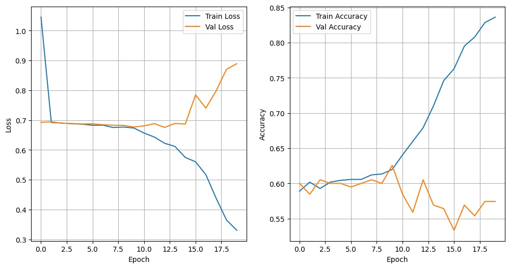

# Table of Contents
- [Table of Contents](#table-of-contents)
- [Introduction](#introduction)
  - [What is a Software Supply Chain?](#what-is-a-software-supply-chain)
  - [What is a Supply Chain Attack?](#what-is-a-supply-chain-attack)
  - [Project Overview](#project-overview)
- [Project Details](#project-details)
  - [Data Generation and Preprocessing](#data-generation-and-preprocessing)
  - [Model Development](#model-development)
  - [Server and Frontend](#server-and-frontend)
  - [Libraries/Frameworks Used](#librariesframeworks-used)
  - [Future Work](#future-work)
- [References](#references)

\newpage

# Introduction

## What is a Software Supply Chain?

A **software supply chain** is just responsible for the development, production, and distribution of software. The software supply chain is a complex network of people, processes, and technologies that work together to create software.

Some of the key components of a software supply chain include:

- **Developers**: The individuals or teams responsible for writing the code that makes up the software.
- **Build Systems**: The tools and processes used to compile, package, and distribute the software.
- **Repositories**: The locations where the source code and compiled software are stored.
- **Distribution Channels**: The methods used to deliver the software to end-users.
- **End-Users**: The individuals or organizations that use the software.

The software supply chain is a critical part of the software development process, as it ensures that software is developed, tested, and delivered to end-users in a secure and efficient manner.

Some software supply chains are used by millions, even billions of people. This makes them an attractive target for attackers, who can use a variety of techniques to compromise the software supply chain and deliver malicious code to end-users.

## What is a Supply Chain Attack?

A **supply chain attack** is a type of cyberattack that targets the software supply chain. In a supply chain attack, an attacker compromises one or more components of the software supply chain in order to deliver malicious code to end-users.

Supply chain attacks can take many forms, including:

- **Malware Injections**: Attackers inject malware into software packages during the build process.
- **Backdoor Insertions**: Attackers insert backdoors into software packages that allow them to access the systems of end-users.
- **Data Exfiltration**: Attackers steal sensitive data from software repositories and distribution channels.
- **Credential Theft**: Attackers steal credentials from developers and use them to compromise the software supply chain.
- **Code Reuse**: Attackers reuse code from open-source projects to introduce vulnerabilities into software packages.
- **Dependency Confusion**: Attackers upload malicious packages to public repositories that have the same name as legitimate packages.

## Project Overview

The goal of this project is to develop a basic AI-powered system to detect potential supply chain attacks in software packages, inspired by incidents like the SolarWinds attack. The system will analyze software package metadata and contents to identify suspicious modifications.

# Project Details

The project will be divided into the following phases:

- **Data Generation and Preprocessing**: Generate a synthetic dataset of software packages and extract features from the metadata.
- **Model Development**: Develop a machine learning model to detect potential supply chain attacks in software packages.
- **Server + Frontend**: Develop a web application for developers to upload software packages and analyze them for potential attacks.

## Data Generation and Preprocessing

The first step in the project is to extract features from software package metadata and contents. 

The data would be time-series data, with each row representing a commit to a software package. The columns would represent features extracted from the metadata and contents of the software package. This is a simplified version of the data that would be available in a real-world scenario(git). 

Considering the metadata of a software package, we can extract features like:

- **Number of Files Changed**
- **Total Lines of Code Added**
- **Total Lines of Code Deleted**
- **Links to External Libraries**
- **Stats(avg,max) of Directory Structure**
- **Stats(avg,max) of File Size**
- **Presence of Executable Files**
- **Commit Hash**
- **Time since last commit**
- **Upload Time**
- **Dependency Count**

If this data is available for a large number of software packages, we can use it to train a machine learning model to detect potential supply chain attacks. However, since we do not have access to a real-world dataset, we will generate a synthetic dataset for this project.

The synthetic dataset will be generated using the following steps:

- **Generate Random Metadata for the first commit**: Generate random metadata for the first commit of a software package.
- **Generate Random but related metadata for subsequent commits**: Generate random metadata for subsequent commits of the software package, ensuring that the metadata is related to the previous commit. This is by using a sigmoid+gaussian function based on the previous commit's metadata.

The synthetic dataset will be used to train and evaluate the machine learning model for detecting potential supply chain attacks in software packages.

## Model Development

The second step in the project is to develop a machine learning model to detect potential supply chain attacks in software packages. The model will be trained on the synthetic dataset generated in the previous step and evaluated on a test set.

So far, considering that the data is time-series, random forest, isolation forest .etc. cannot be used.

Interpreting the data as a 2D matrix(image), we can use CNNs.

The hyperparameters of the model will be tuned to achieve the best performance on the test set with the recall metric as the primary evaluation metric. The reason for using recall is that we want to minimize false negatives, i.e., we want to detect as many potential supply chain attacks as possible.

These are the results of the model:

## Server and Frontend

The final step in the project is to develop a web application for developers to upload software packages and analyze them for potential supply chain attacks. The web application will have the following features:

- **Upload Software Packages**: Developers can upload software packages to the web application.
- **Analyze Software Packages**: The web application will analyze the software packages for potential supply chain attacks using the machine learning model developed in the previous step.
- **Display Results**: The web application will display the results of the analysis to the developers, indicating whether the software package is safe or potentially compromised.
- **List of Packages**: The web application will maintain a list of software packages uploaded by developers and their analysis results.
- **Admin Panel**: The web application will have an admin panel for managing users, software packages, and analysis results.
- **Security**: The web application will implement security best practices to protect against common web application vulnerabilities.

The Server will also perform static data analysis on the software packages such as hashing, and imports analysis.

The web application will provide developers with a simple and intuitive interface for analyzing software packages for potential supply chain attacks.

## Libraries/Frameworks Used

- **Streamlit** for the frontend and backend
- **PyDriller** for extracting metadata from software packages
- **Tensorflow** for the model
- **Python+numpy+pandas** for data generation and preprocessing
- **Sqlite3** for the database

## Future Work

As per our current progress, we have completed the data generation and preprocessing phase and have a working model that can detect potential supply chain attacks in software packages. The next steps in the project are:

- **Alternative Models**: Experiment with different machine learning models to improve the performance of the system.
- **Real-World Dataset**: Train the model on a real-world dataset of software packages to evaluate its performance in a real-world scenario.
- **Deployment**: Deploy the system as a web application for developers to use in practice.
- **Feedback**: Collect feedback from developers using the system and improve it based on their suggestions.

The project has the potential to help developers detect potential supply chain attacks in software packages and prevent them from compromising their systems.

\newpage

# References

Note that all the references are clickable links.

Project Related Links:

- Project Repository: [`https://github.com/SterbenVD/ai5063-project`](https://github.com/SterbenVD/ai5063-project)
- Project Demo: Showed in the presentation + Drive([https://drive.google.com/drive/folders/1_6QnjDtVwLnOjIRvQ5Tl6TYsIkN1SqBi?usp=sharing](https://drive.google.com/drive/folders/1_6QnjDtVwLnOjIRvQ5Tl6TYsIkN1SqBi?usp=sharing))

References:

- [SolarWinds Attack](https://www.fireeye.com/blog/threat-research/2020/12/evasive-attacker-leverages-solarwinds-supply-chain-compromises-with-sunburst-backdoor.html)
- [DFR Lab Dataset](https://dfrlab.org/2023/09/27/software-supply-chain-security-the-dataset/)
- [MITRE ATT&CK Framework](https://attack.mitre.org/)
- [Exploit Database](https://www.exploit-db.com/)